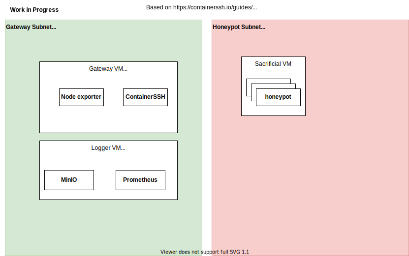

# [WIP] containerSSH-honeypot

:construction::construction::construction:\
This project is still work in progress\
:construction::construction::construction:



Sacrificial VM provides infrastructure for containers.

### Ports

SSH:
- Gateway VM SSH Honeypot: `2222`, `22`
- Gateway VM SSHD: `2333`
- Other VMs SSHD: `22`

Audit:

- MinIO server: `9000`
- MinIO Console: `9090`

Monitoring

- Grafana: `3000`
- Prometheus: `9091`

Services:

- Auth-Config: `8080`
- containerSSH Audit-logs: `9101`

Utilities:

- cAdvisor: `8088`
- Node exporter: `9100`

## Setting up the service on GCP

1. Build VM images following [`/packer/README.md`](/packer/README.md)
2. Provision infrastructure and spin up services following [`/terraform/README.md`](/terraform/README.md)

## Trying out the honeypot

### SSH into the honeypot and download your audit log

1. SSH to the gateway VM from your local computer
   ```bash
   ssh -oHostKeyAlgorithms=+ssh-rsa \
     $(gcloud compute instances describe gateway-vm \
     --format='get(networkInterfaces[0].accessConfigs[0].natIP)' \
     --zone=europe-west3-c)
   ```
   Your will be redirected to a newly created container in the sacrificial VM.

### Download audit log from MinIO Console

All SSH interactions with the honeypot are audited and logged.\
To access the log:

1. In your browser, open MinIO Console at `http://{logger vm IP}:9090`.

   - Get the logger VM IP via
     ```bash
     gcloud compute instances describe logger-vm \
       --format='get(networkInterfaces[0].accessConfigs[0].natIP)' \
       --zone=europe-west3-c
     ```

1. Log in with credentials generated at `./terraform/credentials.txt`

   ```
   MINIO_ROOT_USER="your_user_name"
   MINIO_ROOT_PASSWORD="your_password"
   ```

1. You should see records in the `containerssh` bucket. Download a record you want to analyze.
1. Decode the record with `containerssh-auditlog-decoder` from https://github.com/ContainerSSH/ContainerSSH/releases/tag/v0.4.1, or implement your own decoder.\
   Read more about the record format [here](https://containerssh.io/reference/audit/#the-binary-format-recommended).

Note: [this SSH guide](https://containerssh.io/development/containerssh/ssh/) may help you understand the audit log.

### Monitor system status

We use Prometheus to collect hardware and OS metrics.
We use Grafana for visualizing the collected metrics.

- Grafana: `http://<logger vm IP>:3000`
- Prometheus: `http://<logger vm IP>:9091`

To get logger-vm IP address:

```bash
gcloud compute instances describe logger-vm \
  --format='get(networkInterfaces[0].accessConfigs[0].natIP)' \
  --zone=europe-west3-c
```

## Troubleshooting

GCloud notes

- If `gcloud` failed when installing components:\
  Install `gcloud` with [interactive](https://cloud.google.com/sdk/docs/downloads-interactive#linux-mac). (worked for Fedora)
