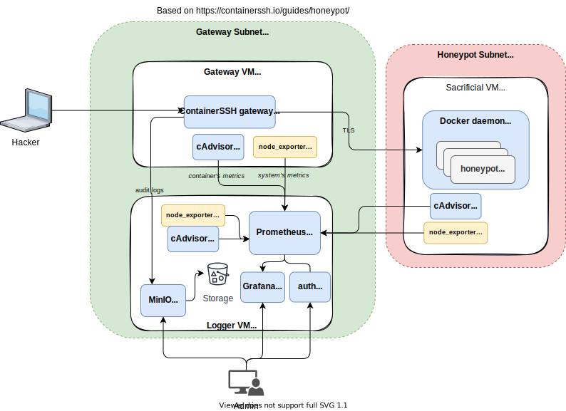

# [WIP] containerSSH-honeypot

:construction::construction::construction:\
This project is still work in progress\
:construction::construction::construction:



Sacrificial VM provides infrastructure for containers.

### Ports

Audit:
- MinIO server: `9000`
- MinIO Console: `9090`

Monitoring
- Grafana: `3000` 
- Prometheus: `9091`

Services:
- Auth-Config: `8080`
- containerSSH Audit-logs: `9101`


Utilities:
- Cadvisor on Gateway-VM: `8088`
- Cadvisor on Logger-VM: `8088`
- Cadvisor on Sacrificial-VM: `8080`
- Node exporter: `9100`

## Setting up the service on GCP

1. Build VM images following [`/packer/README.md`](/packer/README.md)
2. Provision infrastructure and spin up services following [`/terraform/README.md`](/terraform/README.md)

## Trying out the honeypot

1. SSH to the gateway VM from your local computer
   ```bash
   ssh -oHostKeyAlgorithms=+ssh-rsa \
     $(gcloud compute instances describe gateway-vm \
     --format='get(networkInterfaces[0].accessConfigs[0].natIP)') \
     -p 2222
   ```
   Do whatever you like, then exit
1. Log in to MinIO Console at `http://{logger vm IP}:9090` in your browser.
   - Get the logger VM IP via
     ```bash
     gcloud compute instances describe logger-vm \
     --format='get(networkInterfaces[0].accessConfigs[0].natIP)'
     ```
   - MinIO Console default credentials
     - Username: `ROOTNAME`
     - Password: `CHANGEME123`
1. You should see a new record in the `containerssh` bucket. Download it.
1. Decode the record with `containerssh-auditlog-decoder` from https://github.com/ContainerSSH/ContainerSSH/releases/tag/v0.4.1, or implement your own decoder.\
   Read more about the record format [here](https://containerssh.io/reference/audit/#the-binary-format-recommended).

Note: [this SSH guide](https://containerssh.io/development/containerssh/ssh/) may help you understand the SSH log.

## Troubleshooting

GCloud notes

- If `gcloud` failed when installing components:\
  Install `gcloud` with [interactive](https://cloud.google.com/sdk/docs/downloads-interactive#linux-mac). The one with `dnf` doesn't allow installing components.
