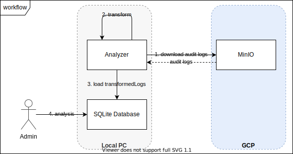
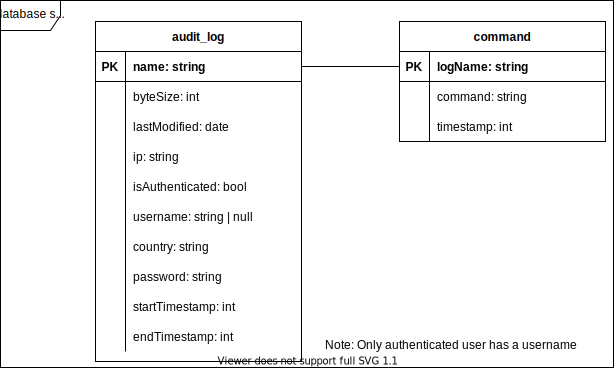

# Log Analyzer

After running the honeypot for sometime, we use this log analyzer to collect audit logs from MinIO and do some data transformation.

## Prerequisite

- Node.js >= 16
- [DB Browser for SQLite](https://github.com/sqlitebrowser/sqlitebrowser) (or another SQL browser that supports SQLite)

## Getting Started

Install software and start processing

```bash
# install software
npm install
# download audit logs, transform and load them to SQLite db
npm run etl
```

Audit logs are inserted into a SQLite DB file at `./audit_log.db`.

Open the file with your SQL browser and have fun with queries!

## How it works

### Workflow



### DB Schema


