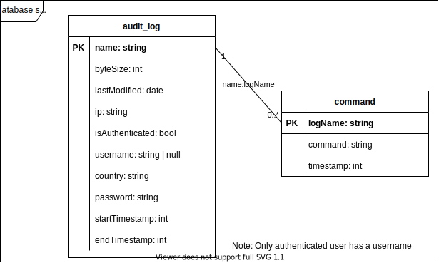

# Log Analyzer

After running the honeypot for sometime, we use this log analyzer to collect audit logs from MinIO and do some data transformation.

## Prerequisite

- Linux
- Node.js >= 16
- [DB Browser for SQLite](https://github.com/sqlitebrowser/sqlitebrowser) (or another SQL browser that supports SQLite)
- [`containerssh-auditlog-decoder@v0.4.1`](https://github.com/ContainerSSH/ContainerSSH/releases/tag/v0.4.1) (`containerssh-auditlog-decoder` command must work in your bash)

## Getting Started

Install software and start processing

```bash
# install software
npm install
# download audit logs, transform and load them to SQLite db
npm run etl
```

Audit logs are inserted into a SQLite DB file at `./audit_log.db`.

Open the db via command line:
```bash
sqlite3 audit_log.db
```

Or open the file with your SQL browser and have fun with queries!

## How it works

### Workflow


### DB Schema



## Results Showcase

- Most popular username: `root`
```sql
SELECT username, COUNT(*) AS frequency
FROM audit_log
WHERE isAuthenticated = TRUE
GROUP BY username
ORDER BY frequency DESC;
```


- Most attacks happened on weekends


```sql
SELECT
	strftime('%w', lastModified) AS "weekDay(0=SUN)",
	COUNT(*) AS frequency
FROM audit_log
GROUP BY "weekDay(0=SUN)"
ORDER BY frequency DESC;
```

- Top passwords

```sql
SELECT 
	password,
	COUNT(*) AS frequency
FROM audit_log
WHERE isAuthenticated is TRUE
GROUP BY password
ORDER BY frequency DESC;
```

- Attacker commands preview

